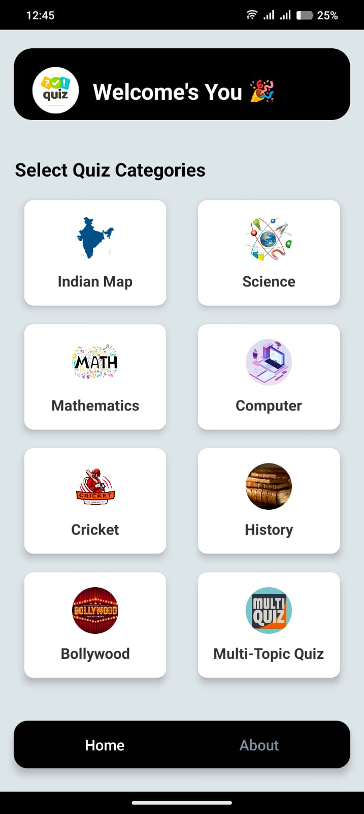
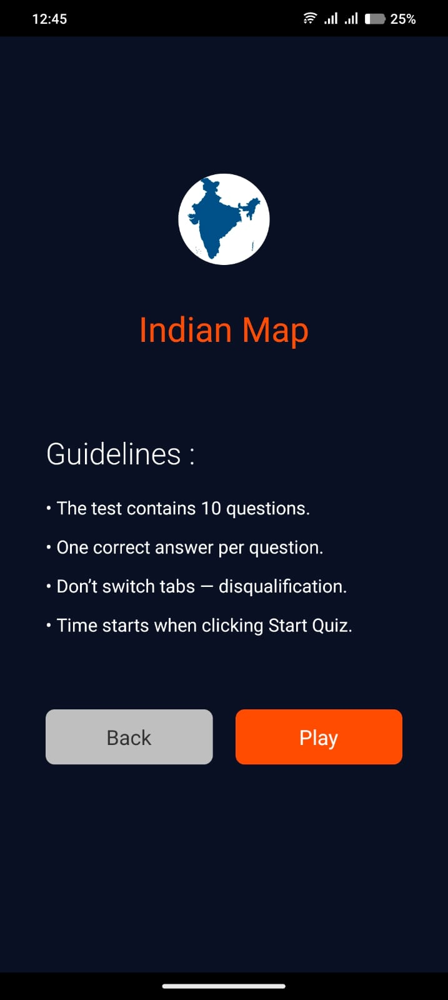
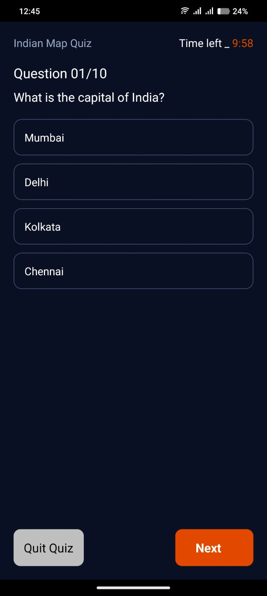

# 🧠 React Native Quiz App

A sleek and interactive **Quiz Application** built using **React Native**, designed to deliver a smooth quiz-taking experience on mobile devices. This app features question-by-question navigation, a countdown timer, dynamic UI updates, and result analysis upon submission.

##Download Quiz App in apk file 

🔗 [Click here to download the APK](https://drive.google.com/file/d/1GV5qD9AnRyLGzOcG2HxO9Lq2hCrzjzBK/view?usp=drive_link)

(Note: Enable “Install from Unknown Sources” on your device to install.)

## 🚀 Features

- 🎯 Topic-based quiz generation
- ⏱️ Countdown timer per quiz
- 💡 Real-time answer selection
- 🔄 Question-by-question navigation
- 🧾 Scorecard & feedback screen
- 🌙 Dark theme UI for immersive experience
- 🧠 AI-generated questions (Future Integration)

---

## 🛠️ Tech Stack

- **Frontend:** React Native (Expo)
- **Navigation:** React Navigation
- **State Management:** React Hooks
- **UI Libraries:** Custom + NativeBase (optional)
- **Backend (Optional):** Ruby on Rails / Node.js (For API & Auth)

---

## 📸 Screenshots

### 🏠 Home Screen


### ✅ Dashboard Screen


### ✅ Guidlines Screen


### ❓ Question Screen


### ✅ Result Screen


## 🔧 Installation

```bash
# Clone the repo
git clone https://github.com/ashish-ranjan-profile/quiz-app.git

# Navigate into the project
cd quiz-app

# Install dependencies
npm install

# Start the app
npx expo start
